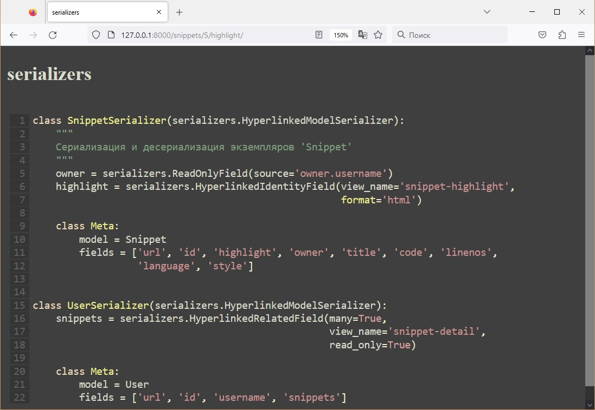

# pastebin
___


Пример веб-API которое позволяет загружать фрагменты исходного кода, для возможности просмотра окружающими.


## Настройка перед запуском

Первое, что нужно сделать, это cклонировать репозиторий:

```sh
$ git clone https://github.com/Andrei2020-web/pastebin_api.git
$ cd pastebin_api
```

Создайте виртуальную среду для установки зависимостей и активируйте ее:

```sh
$ virtualenv venv
$ source venv/bin/activate
```

Затем установите зависимости:

```sh
(venv)$ pip install -r requirements.txt
```

Запускаем сервер:

```sh
(venv)$ python manage.py runserver
```